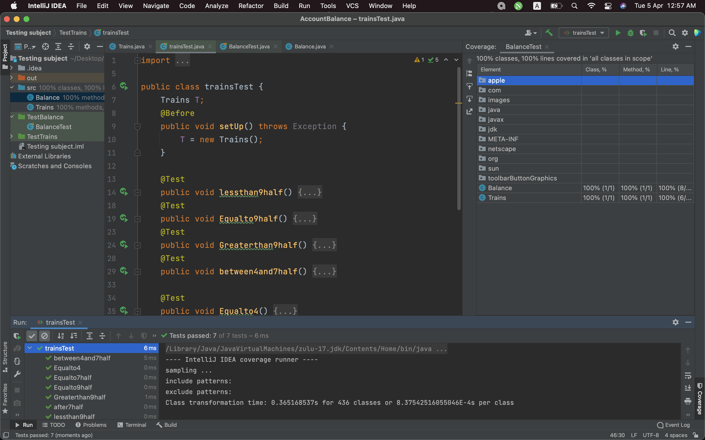

# AccountBalance
HomeWorks of Software Testing subject

hi,Teacher Fatima!
how you doin?
^-^

The two tests 
"Account Balance, Train tickets"are in this project .

All tests worked fine ,all passed based on the code I've written,
I hope they are as they've scripted in the PowerPoint .

Here's the Coverage report screenshot "I didn't know how to print it !"

# TestNG
here's a summary on this topic.

TestNG is an automation testing framework in which NG stands for “Next Generation”. 
TestNG is inspired by JUnit which uses the annotations (@). TestNG overcomes the disadvantages of JUnit and is designed to make end-to-end testing easy.

Advantages of TestNG over JUnit
There are three major advantages of TestNG over JUnit:
* Annotations are easier to understand
* Test cases can be grouped more easily
* Parallel testing is possible

# What is Parameterized Test in Junit?

Parameterized test is to execute the same test over and over again using different values. It helps developer to save time in executing same test which differs only in their inputs and expected results.
